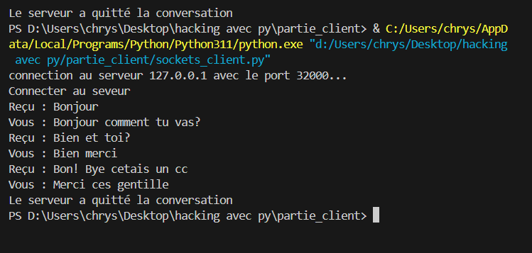
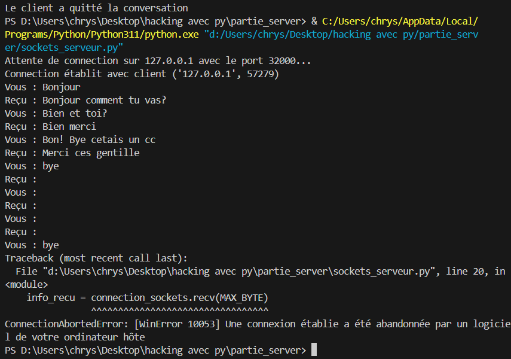

# Projet de Formation PY

Description brève du projet de formation PY. Expliquez ici l'objectif de la formation, les technologies utilisées, et ce que les utilisateurs peuvent apprendre en suivant ce projet.

## Côté Client 

Cette section décrit les fonctionnalités côté client du projet.



## Côté Serveur

Cette section décrit les fonctionnalités côté serveur du projet.



## Installation

Indiquez ici comment les utilisateurs peuvent installer et configurer le projet.

```bash
# Clonez ce dépôt
git clone https://github.com/votre-utilisateur/projet-formation-py.git


